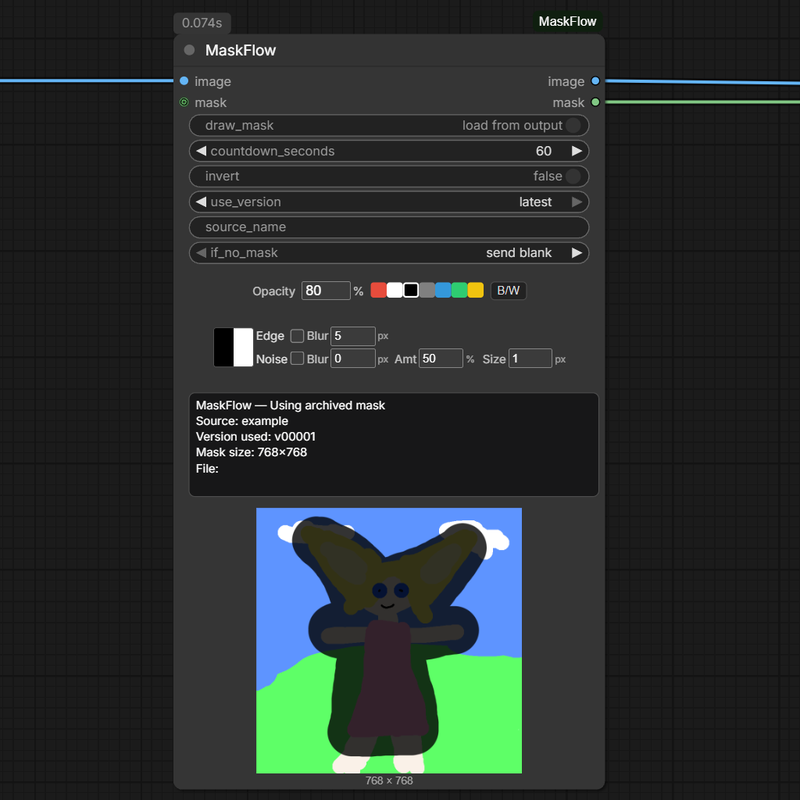

# ComfyUI-MaskFlow

<a href="https://buymeacoffee.com/90red" target="_blank">
  
</a>

> **Still new to this — learning as I go.**
> Bug reports, ideas and pull requests are all welcome, or you can simply
> [buy me a coffee](https://buymeacoffee.com/90red) ☕ — it honestly helps. Thank you! 🙏

Draw a mask **at any point in a workflow** — on a resized, rotated or cropped
image, not only on the original one. Every mask is kept as a numbered file, and
its edge can be feathered and grained. All the controls sit
on the node.



## Install

Clone into `ComfyUI/custom_nodes` and restart ComfyUI:

```bash
git clone https://github.com/90-RED/ComfyUI-MaskFlow
```

## Use

- Place the node **after** your resize / rotate / crop: the mask editor opens on
  the image it receives, so you mask the framed image — no need to mask the source
  image at the start of the graph.
- **Draw mask ON** — running the node opens the editor. The panel counts down and
  saves automatically (`countdown_seconds`, `0` = wait for you to close it).
- **Draw mask OFF** — uses an archived mask instead; `use_version` picks which one.
- **Edge** — feathers the mask edge (`Blur`, in px; `0` = hard edge).
- **Noise** — fills that soft edge with grain. Four styles; click the thumbnail to
  switch. `Amt` = strength, `Size` = grain size, `Blur` = soften the grain.
- Every mask is written to `output/MaskFlow/<source>/vNNNNN.png`, so an earlier
  version is never lost.

Outputs: `image` (pass-through) and `mask`.

## Notes

- Requires a ComfyUI build with the V3 node API (`comfy_api.latest`) — tested on
  ComfyUI 0.35.0 / frontend 1.52.7.
- Writes only to `output/MaskFlow/`. No network access, no telemetry.

## License

MIT — see [LICENSE](LICENSE).
